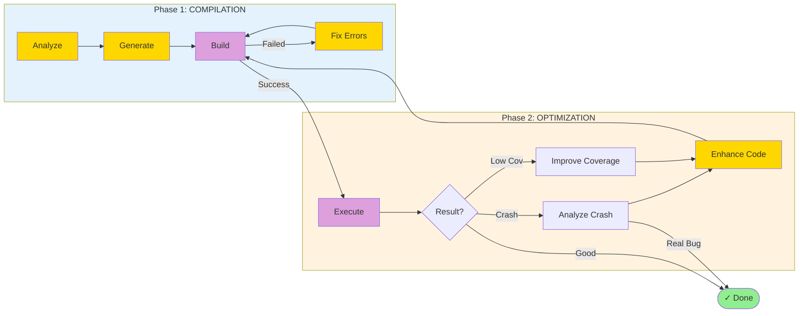

# LogicFuzz

**Automated Fuzz Target Generation using LLM Agents**

LogicFuzz is an intelligent fuzzing framework that leverages Large Language Models (LLMs) to automatically generate high-quality fuzz targets. It uses a **two-phase agentic workflow** to achieve high compilation success rates and maximize code coverage.

---

## 🎯 Key Features

- **🤖 AI-Powered Generation**: Uses LLM agents to analyze functions and generate fuzz targets
- **📊 High Success Rate**: 70-85% compilation success through intelligent error fixing
- **🔄 Iterative Improvement**: Automatically optimizes coverage and discovers real bugs
- **🛡️ Two-Phase Workflow**: Separate compilation and optimization phases with smart routing
- **⚡ Token Efficient**: Optimized prompts with 80% token reduction
- **🔍 FI Integration**: Leverages Fuzz Introspector for enhanced context

**Supported Models:**
- OpenAI GPT (gpt-4, gpt-5)
- Vertex AI Gemini (gemini-2-5-pro-chat)

---

## 🚀 Quick Start

### Installation

```bash
# 1. Clone the repository
git clone https://github.com/your-org/logicfuzz.git
cd logicfuzz

# 2. Install dependencies
pip install -r requirements.txt

# 3. Set up API keys (choose one)
export OPENAI_API_KEY="your-api-key"
# or
export VERTEXAI_PROJECT="your-project-id"
```

### Basic Usage

```bash
# Generate fuzz targets for a project
python agent_graph/main.py -y conti-benchmark/cjson.yaml --model gpt-5

# Generate for a specific function
python agent_graph/main.py -y conti-benchmark/cjson.yaml -f cJSON_Parse --model gpt-5

# Run with Fuzz Introspector context (better results)
python agent_graph/main.py -y conti-benchmark/mosh.yaml \
  --model gpt-5 -n 5 --context -e http://0.0.0.0:8080/api
```

---

## 📐 Architecture Overview

### Two-Phase Workflow

LogicFuzz uses a **two-phase approach** to ensure both compilation success and fuzzing effectiveness:



**Phase 1 (Compilation)**: Focus on getting the fuzz target to compile
- Analyze target function semantics and constraints
- Generate initial fuzz target with proper setup
- Intelligently fix compilation errors with code context
- Fallback to complete regeneration if needed

**Phase 2 (Optimization)**: Focus on maximizing fuzzing effectiveness
- Execute fuzzer and collect coverage metrics
- Analyze crashes to identify real bugs
- Improve code to increase coverage
- Iterate until goals achieved or coverage stabilizes

### System Architecture

```
┌─────────────────────────────────────────────────────────┐
│                   User Entry Points                      │
│  agent_graph/main.py  or  run_logicfuzz.py --agent     │
└────────────────────┬────────────────────────────────────┘
                     ↓
           ┌─────────────────────┐
           │  LangGraph Workflow │
           │   (State Machine)   │
           └─────────────────────┘
                     ↓
      ┌──────────────┴──────────────┐
      ↓                              ↓
┌──────────────┐              ┌──────────────┐
│  LLM Agents  │              │  Non-LLM     │
│              │              │  Executors   │
│ • Analyzer   │              │ • Build      │
│ • Generator  │              │ • Execution  │
│ • Enhancer   │              │              │
└──────────────┘              └──────────────┘
```

**📖 For detailed agent design and workflow, see [agent_graph/README.md](agent_graph/README.md)**

---

## 📁 Project Structure

```
logicfuzz/
├── agent_graph/              # 🔥 Core: LangGraph workflow implementation
│   ├── agents/              # Agent base classes
│   ├── nodes/               # Workflow nodes (LLM & non-LLM)
│   ├── workflow.py          # State machine definition
│   ├── state.py             # State management
│   └── main.py              # Entry point
├── conti-benchmark/         # Benchmark YAML configurations
├── prompts/                 # LLM prompt templates
├── experiment/              # Evaluation and metrics
├── report/                  # Result analysis tools
├── data_prep/               # Benchmark data preparation
└── run_logicfuzz.py        # Alternative entry point
```

---

## 🎓 Usage Examples

### 1. Generate for OSS-Fuzz Project

```bash
# Single trial
python agent_graph/main.py -y conti-benchmark/libxml2.yaml --model gpt-5

# Multiple trials (5 targets per function)
python agent_graph/main.py -y conti-benchmark/libxml2.yaml --model gpt-5 -n 5
```

### 2. With Fuzz Introspector Context (Recommended)

Fuzz Introspector provides rich context about target functions (call graphs, complexity, etc.), significantly improving generation quality.

**Step 1: Launch FI Server (separate terminal)**
```bash
bash report/launch_local_introspector.sh
# Starts FI server on http://0.0.0.0:8080
```

**Step 2: Run LogicFuzz with FI**
```bash
python agent_graph/main.py \
  -y conti-benchmark/mosh.yaml \
  --model gpt-5 -n 5 \
  --context -e http://0.0.0.0:8080/api
```

### 3. Test Your Own Project (Not in OSS-Fuzz)

Want to test your own project? See our comprehensive guide: **[NEW_PROJECT_SETUP.md](docs/NEW_PROJECT_SETUP.md)**

Quick steps:
```bash
# 1. Create OSS-Fuzz project structure
mkdir -p oss-fuzz/projects/my-project

# 2. Create Dockerfile, build.sh, project.yaml
# See docs/NEW_PROJECT_SETUP.md for templates

# 3. Create benchmark YAML
cat > conti-benchmark/my-project.yaml << 'EOF'
functions:
- name: "my_function"
  params:
  - name: "data"
    type: "uint8_t*"
  - name: "size"
    type: "size_t"
  return_type: "int"
  signature: "int my_function(uint8_t*, size_t)"
language: "c"
project: "my-project"
EOF

# 4. Run LogicFuzz
python agent_graph/main.py -y conti-benchmark/my-project.yaml --model gpt-5
```

### 4. Batch Processing Multiple Projects

```bash
python run_logicfuzz.py \
  --benchmarks-directory conti-benchmark/all \
  --model gpt-5 \
  --num-samples 10
```

---

## 📖 Documentation

| Document | Description |
|----------|-------------|
| [agent_graph/README.md](agent_graph/README.md) | **Agent design and workflow details** |
| [NEW_PROJECT_SETUP.md](docs/NEW_PROJECT_SETUP.md) | Complete guide for custom projects |
| [SIGNATURE_FIX_README.md](docs/SIGNATURE_FIX_README.md) | Function signature extraction |
| [Usage.md](Usage.md) | OSS-Fuzz quick setup |
| [data_prep/README.md](data_prep/README.md) | Benchmark preparation |

---

## 🔧 Configuration

### Command Line Options

```bash
python agent_graph/main.py --help

Key options:
  -y, --yaml          Benchmark YAML file (required)
  --model             LLM model (gpt-4, gpt-5, gemini-2-5-pro-chat)
  -f, --function      Target specific function
  -n, --num-samples   Number of trials per function (default: 1)
  --context           Enable Fuzz Introspector context
  -e, --endpoint      FI server endpoint (default: http://0.0.0.0:8080/api)
  --max-iterations    Max optimization iterations (default: 5)
  --run-timeout       Fuzzer execution timeout in seconds (default: 600)
```

### Environment Variables

```bash
# OpenAI
export OPENAI_API_KEY="your-api-key"

# Vertex AI
export VERTEXAI_PROJECT="your-project-id"
export VERTEXAI_LOCATION="us-central1"

# OSS-Fuzz directory (default: ./oss-fuzz)
export OSS_FUZZ_DIR="/path/to/oss-fuzz"
```

---

## 📊 Performance

- **Compilation Success Rate**: 70-85%
- **Coverage Improvement**: Up to 50% increase over baseline
- **Token Efficiency**: 80% reduction compared to naive approaches
- **Real Bug Discovery**: Successfully identifies exploitable vulnerabilities

---

## 🤝 Contributing

We welcome contributions! Please see our contributing guidelines.

---

## 📄 License

[Your License Here]

---

## 🔗 Related Projects

- [OSS-Fuzz](https://github.com/google/oss-fuzz) - Continuous fuzzing for open source
- [Fuzz Introspector](https://github.com/ossf/fuzz-introspector) - Code analysis for fuzzing
- [LangGraph](https://github.com/langchain-ai/langgraph) - Agentic workflow framework
