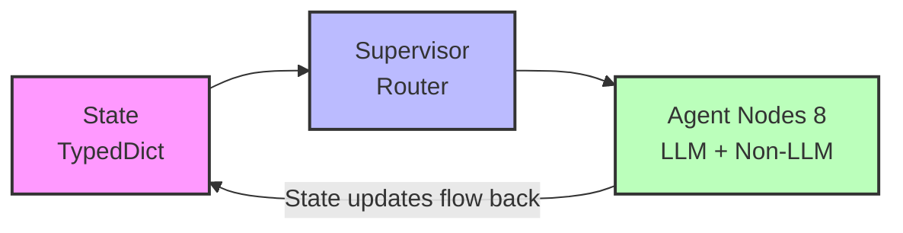

# Agent Graph Architecture

**LangGraph-based Multi-Agent Fuzzing Workflow**

This document provides a deep dive into LogicFuzz's agent graph architecture, implementation details, and design decisions.

---

## 📊 Architecture Overview

LogicFuzz uses **LangGraph** to implement a stateful, multi-agent workflow with **Supervisor-Agent Pattern**. The workflow is organized into two distinct phases with different objectives and termination criteria.

### Key Components



---

## 🔄 Detailed Workflow

### Phase 1: COMPILATION

**Objective**: Generate a fuzz target that compiles successfully and calls the target function.

```mermaid
graph TD
    Start[START] --> FuncAnalyzer[Function Analyzer]
    FuncAnalyzer -->|"Analyze target function API<br/>(Identify constraints, Archetype)"| Prototyper[Prototyper]
    
    Prototyper -->|"Generate initial fuzz target"| BuildNode[Build Node]
    
    BuildNode --> CheckCompile{Compile Success?}
    
    %% Compilation Failure Loop
    CheckCompile -- NO --> FixerBuild[Fixer]
    FixerBuild -- "Generate fix" --> BuildNode
    
    %% Validation Failure Loop
    CheckCompile -- YES --> CheckValidation{Target Function Called?}
    CheckValidation -- NO --> FixerVal[Fixer]
    FixerVal -- "Fix validation error" --> BuildNode
    
    %% Success
    CheckValidation -- YES --> Optimize[Switch to Optimization]
    
    %% Failures (simplified, max retries lead to END)
    FixerBuild -.->|"Max 3 retries"| EndFail[END (fail)]
    FixerVal -.->|"Max 2 retries"| EndFail
```

**Key Mechanisms:**

1. **Compilation Retry Logic**
   - Max 3 fixer retries for build errors
   - Each retry has access to previous fix attempts via session memory
   - After 3 retries → END (compilation failed)

2. **Validation Check**
   - Build Node validates that target function is called in fuzz driver
   - Uses static analysis of generated code
   - If validation fails → separate retry counter (max 2)

3. **Error Context Extraction**
   - Only send ±10 lines around error location to Fixer
   - Reduces token usage by 95% compared to full file
   - Preserves context for accurate fixing

### Phase 2: OPTIMIZATION

**Objective**: Execute the fuzzer once and validate any crashes found. No iteration loops.

```mermaid
graph TD
    Execution[Execution Node] -->|"Run fuzzer (single pass)"| CheckCrash{Crash Found?}
    
    CheckCrash -- NO --> EndSuccess[END Success<br/>(Log coverage)]
    CheckCrash -- YES --> CrashAnalyzer[Crash Analyzer]
    
    CrashAnalyzer -->|"Classify crash type"| Feasibility[Crash Feasibility Analyzer]
    
    Feasibility --> CheckFeasible{Feasible?}
    
    CheckFeasible -- YES --> EndBug[END True Bug]
    CheckFeasible -- NO --> Fixer[Fixer]
    
    Fixer -->|"Fix false positive<br/>(1 attempt only)"| EndFixed[END Success]
```

**Key Mechanisms:**

1. **Single-Pass Execution**
   - No iteration loops (removed coverage improvement cycles)
   - Execute fuzzer once → analyze → done
   - Reduces token cost and execution time

2. **Two-Stage Crash Validation**
   - **Stage 1 (Crash Analyzer)**: Classify crash type and severity
   - **Stage 2 (Crash Feasibility Analyzer)**: Deep validation to filter false positives
   - Only feasible crashes count as "success"

3. **False Positive Handling**
   - If crash is not feasible (harness issue, timeout, etc.)
   - **One** fixer attempt to fix the harness
   - Then END (no retry loop)

4. **No Coverage Iteration**
   - Coverage data is logged for observability
   - No Coverage Analyzer node in main workflow
   - No iterative enhancement based on coverage
   - Rationale: High token cost, low bug-finding value

---

## 🤖 Agent Implementations

### 1. Supervisor Node

**Type**: Router (Non-LLM)  
**File**: `agent_graph/nodes/supervisor_node.py`

**Responsibilities:**
- Determine next action based on workflow state
- Enforce retry limits (compilation: 3, validation: 2, optimization: 1)
- Inject session memory into agent prompts (top-3 items)
- Phase transition logic (compilation → optimization)
- Loop prevention (max 10 visits per node)

**Key Decision Logic:**

```python
def _determine_next_action(state: FuzzingWorkflowState) -> str:
    workflow_phase = state.get("workflow_phase", "compilation")
    
    # PHASE 1: COMPILATION
    if workflow_phase == "compilation":
        if not state.get("function_analysis"):
            return "function_analyzer"
        if not state.get("fuzz_target_source"):
            return "prototyper"
        if state.get("compile_success") is None:
            return "build"
        if not state.get("compile_success"):
            if state.get("compilation_retry_count", 0) < 3:
                return "fixer"
            else:
                return "END"  # Give up after 3 retries
        if has_validation_error:
            if state.get("validation_failure_count", 0) < 2:
                return "fixer"
            else:
                return "END"
        # Compilation + validation success
        return "execution"  # Switch to optimization
    
    # PHASE 2: OPTIMIZATION
    elif workflow_phase == "optimization":
        if state.get("run_success") is None:
            return "execution"
        if crashes_detected:
            if not state.get("crash_analysis"):
                return "crash_analyzer"
            if not state.get("context_analysis"):
                return "crash_feasibility_analyzer"
            if context_analysis["feasible"]:
                return "END"  # Success! True bug found
            else:
                return "fixer"  # Fix false positive (1 attempt)
        # No crash, just log coverage and end
        return "END"
```

### 2. Function Analyzer

**Type**: LLM Agent  
**File**: `agent_graph/agents/function_analyzer.py`

**Input:**
- Target function signature
- FuzzIntrospector data (call graph, type info)
- Optional source code

**Output:**
```python
{
    "api_constraints": [
        "Must call init() before process()",
        "Returns NULL on error, check before use"
    ],
    "archetype": "stateful_decoder",  # or "simple_parser", "protocol_handler"
    "calling_convention": "Takes uint8_t* data, size_t size",
    "initialization_required": true,
    "cleanup_required": true
}
```

**Stored in**: `state["function_analysis"]` + `state["session_memory"]["api_constraints"]`

### 3. Prototyper

**Type**: LLM Agent  
**File**: `agent_graph/agents/prototyper.py`

**Input:**
- Function analysis (archetype, constraints)
- Session memory (API constraints)
- FuzzingContext (headers, dependencies)

**Output:**
```python
{
    "fuzz_target_source": "...",  # fuzz_driver.cc content
    "build_script_source": "..."  # build.sh content
}
```

**Key Features:**
- Uses archetype templates for initial structure
- Applies API constraints from session memory
- Generates both driver code and build script

### 4. Fixer

**Type**: LLM Agent  
**File**: `agent_graph/agents/fixer.py`

**Modes:**
1. **Compilation Fixing**: Fix build errors (max 3 retries)
2. **Validation Fixing**: Fix target function call validation (max 2 retries)
3. **False Positive Fixing**: Fix harness issues causing false crashes (max 1 retry)

**Input:**
- Error context (±10 lines around error)
- Session memory (known fixes)
- Build errors or crash analysis

**Output:**
```python
{
    "fuzz_target_source": "...",  # Fixed fuzz_driver.cc
    "build_script_source": "...",  # Fixed build.sh (if needed)
    "fix_applied": "Added -lz to LDFLAGS"
}
```

**Key Features:**
- Context-aware: only sees relevant error context
- Checks session memory for known fixes
- Stores new successful fixes in session memory

### 5. Crash Analyzer

**Type**: LLM Agent  
**File**: `agent_graph/agents/crash_analyzer.py`

**Input:**
- Crash stack trace
- ASAN/UBSAN report
- Fuzz target source

**Output:**
```python
{
    "crash_type": "heap-buffer-overflow",
    "crash_location": "parse_json:142",
    "severity": "high",
    "description": "Write beyond allocated buffer in JSON parsing",
    "stack_trace": "..."
}
```

### 6. Crash Feasibility Analyzer

**Type**: LLM Agent  
**File**: `agent_graph/agents/crash_feasibility_analyzer.py`

**Input:**
- Crash analysis
- Fuzz target source
- Target function source (if available)

**Output:**
```python
{
    "feasible": true,  # or false
    "reasoning": "Crash is in target code (parse_json), reachable via public API",
    "security_impact": "High - buffer overflow can lead to code execution",
    "reproducibility": "Stable reproducer available",
    "recommendations": []  # If not feasible, how to fix harness
}
```

**Key Features:**
- Distinguishes target code crashes from harness crashes
- Assesses security relevance
- Provides actionable recommendations for false positives

### 7. Build Node

**Type**: Execution Node (Non-LLM)  
**File**: `agent_graph/nodes/execution_node.py::build_node`

**Responsibilities:**
- Compile fuzz target in OSS-Fuzz Docker container
- Parse compilation errors
- Validate target function call (static analysis)
- Extract error context (±10 lines)

**Key Features:**
- Uses `experiment.builder_runner.BuilderRunner`
- Validates that target function is referenced in generated code
- Stores detailed build errors for Fixer

### 8. Execution Node

**Type**: Execution Node (Non-LLM)  
**File**: `agent_graph/nodes/execution_node.py::execution_node`

**Responsibilities:**
- Run fuzzer with timeout
- Collect LLVM source-based coverage
- Detect crashes (ASAN/UBSAN)
- Extract crash artifacts

**Key Features:**
- Uses `experiment.evaluator.Evaluator`
- Parses textcov for line-level coverage
- Stores crash reproducers for analysis

---

## 🧠 Session Memory System

### Purpose

Replace expensive conversation history (100k+ tokens per agent) with lightweight shared memory (3-5 key insights).

### Structure

```python
state["session_memory"] = {
    "api_constraints": [
        {"content": "Must call init() before decode()", "confidence": "HIGH"},
        {"content": "Returns NULL on error", "confidence": "MEDIUM"}
    ],
    "archetype": "stateful_decoder",
    "known_fixes": [
        {
            "error": "undefined reference to `compress`",
            "solution": "Add -lz to LDFLAGS",
            "confidence": "HIGH"
        }
    ],
    "build_context": {
        "last_error_location": "fuzz_driver.cc:142",
        "last_error_context": "..."  # ±10 lines
    }
}
```

### Injection Strategy

Supervisor injects session memory into each agent's prompt:

```python
def inject_session_memory(prompt: str, session_memory: dict) -> str:
    """Inject top-3 session memory items by confidence + recency."""
    memory_text = format_session_memory(session_memory, max_items=3)
    return f"{memory_text}\n\n{prompt}"
```

**Benefits:**
- 90% memory reduction vs full conversation history
- Faster agent execution
- Still preserves critical knowledge

---

## 📊 State Management

### FuzzingWorkflowState Schema

```python
class FuzzingWorkflowState(TypedDict):
    # Core info
    benchmark: Dict[str, Any]
    trial: int
    work_dirs: Dict[str, Any]
    
    # Fuzzing context (immutable, prepared once)
    context: NotRequired[Dict[str, Any]]
    
    # Agent outputs
    function_analysis: NotRequired[Dict[str, Any]]
    fuzz_target_source: NotRequired[str]
    build_script_source: NotRequired[str]
    
    # Build results
    compile_success: NotRequired[bool]
    build_errors: NotRequired[List[str]]
    target_function_called: NotRequired[bool]
    
    # Execution results
    run_success: NotRequired[bool]
    crashes: NotRequired[bool]
    crash_info: NotRequired[Dict[str, Any]]
    coverage_percent: NotRequired[float]
    
    # Analysis results
    crash_analysis: NotRequired[Dict[str, Any]]
    context_analysis: NotRequired[Dict[str, Any]]
    
    # Workflow control
    workflow_phase: NotRequired[str]  # "compilation" or "optimization"
    compilation_retry_count: NotRequired[int]
    validation_failure_count: NotRequired[int]
    optimization_fixer_count: NotRequired[int]
    node_visit_counts: NotRequired[Dict[str, int]]
    
    # Session memory
    session_memory: NotRequired[Dict[str, Any]]
```

### State Updates

Each node returns a dictionary of updates to merge into the state:

```python
def prototyper_node(state: FuzzingWorkflowState, config: RunnableConfig) -> Dict[str, Any]:
    # Generate code
    result = prototyper.generate(state["function_analysis"], state["context"])
    
    # Return updates
    return {
        "fuzz_target_source": result["fuzz_target"],
        "build_script_source": result["build_script"],
        "session_memory": {
            **state.get("session_memory", {}),
            "generation_archetype": result["archetype"]
        }
    }
```

---

## 🔧 Configuration Adapters

### Purpose

Bridge between LangGraph's `RunnableConfig` and original agent implementations.

### ConfigAdapter

```python
class ConfigAdapter:
    @staticmethod
    def create_config(llm: LLM, args: argparse.Namespace) -> RunnableConfig:
        return {
            "configurable": {
                "llm": llm,
                "args": args,
                # ... other config
            }
        }
    
    @staticmethod
    def extract_llm(config: RunnableConfig) -> LLM:
        return config["configurable"]["llm"]
```

### StateAdapter

```python
class StateAdapter:
    @staticmethod
    def to_benchmark(state: FuzzingWorkflowState) -> Benchmark:
        """Convert state dict to Benchmark object."""
        
    @staticmethod
    def to_work_dirs(state: FuzzingWorkflowState) -> WorkDirs:
        """Convert state dict to WorkDirs object."""
```

---

## 📁 File Structure

```
agent_graph/
├── workflow.py              # Main workflow definition (StateGraph)
├── state.py                 # FuzzingWorkflowState schema
├── memory.py                # Session memory utilities
├── data_context.py          # FuzzingContext (data preparation)
│
├── nodes/                   # LangGraph node wrappers
│   ├── supervisor_node.py   # Router logic
│   ├── function_analyzer_node.py
│   ├── prototyper_node.py
│   ├── fixer_node.py
│   ├── crash_analyzer_node.py
│   ├── crash_feasibility_analyzer_node.py
│   └── execution_node.py    # Build + execution nodes
│
├── agents/                  # Agent implementations (LLM logic)
│   ├── base.py              # LangGraphAgent base class
│   ├── function_analyzer.py
│   ├── prototyper.py
│   ├── fixer.py
│   ├── crash_analyzer.py
│   └── crash_feasibility_analyzer.py
│
├── adapters.py              # Config/state adapters
├── prompt_loader.py         # Prompt loading utilities
├── session_memory_injector.py  # Memory injection logic
├── api_context_extractor.py    # FuzzIntrospector integration
└── header_extractor.py         # Header dependency resolution
```

---

## 🎯 Design Decisions

### Why Two Phases?

**Rationale**: Different objectives require different strategies.

- **Compilation Phase**: Focus on correctness (does it build?)
  - Multiple retries acceptable (3)
  - Validation is critical (target function must be called)
  
- **Optimization Phase**: Focus on bug finding (does it crash?)
  - Single execution (no iteration loops)
  - Crash validation is critical (true bug vs false positive)

### Why No Coverage Iteration?

**Rationale**: High cost, low return.

- Each iteration requires: build → run → coverage analysis → fixer → repeat
- Token cost: ~50k per iteration
- Time cost: ~5 minutes per iteration
- Empirical observation: Most bugs found in first execution
- Coverage improvement rarely leads to new crashes

### Why Session Memory Instead of Conversation History?

**Rationale**: 90% memory savings with minimal information loss.

- Full conversation history: 100k+ tokens per agent
- Session memory: 3-5 key insights (~1k tokens)
- Key insight: Most conversation content is redundant
- Critical information (API constraints, known fixes) is preserved

### Why Strict Retry Limits?

**Rationale**: Prevent infinite loops and reduce token waste.

- Without limits: Can loop indefinitely on unfixable errors
- With limits: Fast failure, clear error messages
- Empirical observation: If 3 retries don't fix it, it's likely unfixable

---

## 📊 Performance Characteristics

### Token Usage (per trial)

| Component | Tokens | Notes |
|-----------|--------|-------|
| Function Analyzer | 5-10k | API analysis |
| Prototyper | 8-15k | Initial generation |
| Fixer (per retry) | 3-5k | Error fixing |
| Crash Analyzer | 2-4k | Crash classification |
| Crash Feasibility | 3-6k | Deep validation |
| Session Memory | 0.5-1k | Shared across agents |
| **Total (success case)** | **20-40k** | Compilation + optimization |
| **Total (with retries)** | **30-60k** | 2-3 compilation fixes |

### Execution Time (per trial)

| Phase | Time | Notes |
|-------|------|-------|
| Function Analysis | 10-30s | LLM call |
| Prototyper | 20-40s | LLM call |
| Build | 60-120s | OSS-Fuzz compilation |
| Fixer (per retry) | 30-60s | LLM call + rebuild |
| Execution | 60-300s | Fuzzer runtime (configurable) |
| Crash Analysis | 15-30s | LLM calls |
| **Total (success)** | **3-8 min** | Single execution |
| **Total (with retries)** | **5-15 min** | 2-3 compilation fixes |

---

## 🧪 Testing

### Unit Tests

Test individual agents in isolation:

```bash
pytest agent_graph/agents/test_function_analyzer.py
pytest agent_graph/agents/test_prototyper.py
pytest agent_graph/agents/test_fixer.py
```

### Integration Tests

Test workflow execution end-to-end:

```bash
pytest agent_graph/test_workflow.py
```

### Workflow Visualization

Generate Mermaid diagram of workflow:

```python
from agent_graph import FuzzingWorkflow

workflow = FuzzingWorkflow(llm, args)
graph = workflow.create_workflow()
print(graph.get_graph().draw_mermaid())
```

---

## 🔍 Debugging

### Enable Debug Logging

```python
import logging
logging.basicConfig(level=logging.DEBUG)
```

### Inspect State at Each Step

```python
def debug_node(state: FuzzingWorkflowState, config: RunnableConfig):
    print(f"Current state: {state}")
    return {}

workflow.add_node("debug", debug_node)
workflow.add_edge("prototyper", "debug")
workflow.add_edge("debug", "build")
```

### Visualize Execution Path

```python
from langgraph.pregel import GraphRecursionError

result = workflow.run(benchmark, trial)
print(f"Visited nodes: {result['node_visit_counts']}")
print(f"Final phase: {result['workflow_phase']}")
```

---

## 📚 Additional Resources

- **[LangGraph Documentation](https://langchain-ai.github.io/langgraph/)** - LangGraph framework docs
- **[prompts/](../prompts/)** - All LLM system prompts
- **[experiment/](../experiment/)** - Build & execution infrastructure
- **[docs/NEW_PROJECT_SETUP.md](../docs/NEW_PROJECT_SETUP.md)** - Adding new projects
- **[Usage.md](../Usage.md)** - Quick start guide

