# Agent Architecture & Workflow

This document describes the **agent-based design** of LogicFuzz and how agents collaborate through a state machine workflow.

---

## 🎯 Overview

LogicFuzz uses a **two-phase agentic workflow** powered by LangGraph to automatically generate high-quality fuzz targets:

- **Phase 1 (Compilation)**: Get the fuzz target to compile successfully
- **Phase 2 (Optimization)**: Maximize fuzzing effectiveness through iterative improvement

---

## 🏗️ Agent Architecture

### Agent Modules

LogicFuzz consists of **3 types of modules** that collaborate through a centralized state machine:


### Module Details

| Module | Type | Purpose | Input | Output |
|--------|------|---------|-------|--------|
| **Function Analyzer** | 🟡 LLM | Analyze API semantics | Function signature, source code | Preconditions, constraints, setup requirements |
| **Prototyper** | 🟡 LLM | Generate fuzz target | Function analysis, project context | Fuzz target code, build scripts |
| **Enhancer** | 🟡 LLM | Fix & improve code | Build errors OR coverage feedback | Enhanced code |
| **Crash Analyzer** | 🔴 LLM | Classify crashes | Crash stack trace | Crash type, severity |
| **Coverage Analyzer** | 🔴 LLM | Suggest improvements | Coverage report, code | Improvement suggestions |
| **Context Analyzer** | 🔴 LLM | Validate feasibility | Crash info, code context | Real bug OR false positive |
| **Build** | 🟣 Non-LLM | Compile target | Fuzz target code | Binary OR error messages |
| **Execution** | 🟣 Non-LLM | Run fuzzer | Compiled binary | Coverage, crashes |

---

## 🔄 Workflow Design

### High-Level Workflow

```mermaid
flowchart LR
    Start([Start]) --> Analyze
    
    subgraph Phase1["📋 Phase 1: COMPILATION"]
        Analyze[Function<br/>Analyzer] --> Generate[Prototyper]
        Generate --> Build[Build]
        Build -->|Failed| Fix[Enhancer<br/>Fix Errors]
        Fix --> Build
        Build -->|Failed 3x| Regen[Prototyper<br/>Regenerate]
        Regen --> Build
    end
    
    subgraph Phase2["🚀 Phase 2: OPTIMIZATION"]
        Run[Execution] --> Check{Result?}
        Check -->|Crash| CrashAna[Crash<br/>Analyzer]
        CrashAna --> Context[Context<br/>Analyzer]
        Context -->|False+| Improve[Enhancer<br/>Fix]
        Check -->|Low Cov| CovAna[Coverage<br/>Analyzer]
        CovAna --> Improve
        Improve --> Build
    end
    
    Build -->|Success| Run
    Check -->|Good| Done([✓ Done])
    Context -->|Real Bug| Done
    
    style Phase1 fill:#E3F2FD
    style Phase2 fill:#FFF3E0
    style Analyze fill:#FFD700
    style Generate fill:#FFD700
    style Regen fill:#FFD700
    style Fix fill:#FFD700
    style Improve fill:#FFD700
    style CrashAna fill:#FF6347
    style Context fill:#FF6347
    style CovAna fill:#FF6347
    style Build fill:#DDA0DD
    style Run fill:#DDA0DD
    style Done fill:#90EE90
```



### Workflow Phases

#### Phase 1: Compilation

**Goal**: Get the fuzz target to compile successfully

**Flow**:
1. **Function Analyzer** → Understand function semantics, preconditions, constraints
2. **Prototyper** → Generate initial fuzz target and build scripts
3. **Build** → Attempt compilation
4. **If build fails**:
   - **Enhancer** (up to 3 times) → Fix errors with intelligent code context
   - If still failing → **Prototyper** regenerates with error feedback
5. **Build success** → Switch to Phase 2

**Key Features**:
- Intelligent error context extraction (error lines ±10)
- Fallback to complete regeneration after 3 fix attempts
- Preserves error history for better regeneration

#### Phase 2: Optimization

**Goal**: Maximize fuzzing effectiveness and discover bugs

**Flow**:
1. **Execution** → Run fuzzer, collect coverage and crashes
2. **If crashed**:
   - **Crash Analyzer** → Classify crash type and severity
   - **Context Analyzer** → Validate if it's a real bug
   - If real bug → **Done!** 🎉
   - If false positive → **Enhancer** fixes the issue
3. **If low coverage** (< 50% or diff < 5%):
   - **Coverage Analyzer** → Suggest improvements
   - **Enhancer** → Implement suggestions
   - → Build and run again
4. **If coverage is good**:
   - Check for stagnation (3 consecutive runs without improvement)
   - If stable → **Done!** ✓

**Key Features**:
- Crash feasibility validation prevents false positives
- Coverage-driven iterative improvement
- Automatic stagnation detection (3 consecutive no-improvement runs)
- Maximum iteration limit (default: 5)

---

## 🎮 State Machine

### Central Supervisor

The **Supervisor** is the central router that decides which agent to call next based on the current state:

```mermaid
flowchart TD
    Supervisor{Supervisor<br/>Router} --> Phase{Which Phase?}
    
    Phase -->|Compilation| P1
    Phase -->|Optimization| P2
    
    P1{Has Analysis?} -->|No| FA[→ Function Analyzer]
    P1 -->|Yes| P1_2{Has Code?}
    P1_2 -->|No| Proto[→ Prototyper]
    P1_2 -->|Yes| P1_3{Build Status?}
    
    P1_3 -->|Not Built| Bd[→ Build]
    P1_3 -->|Failed| P1_4{Retry < 3?}
    P1_4 -->|Yes| Enh1[→ Enhancer<br/>Fix Errors]
    P1_4 -->|No| P1_5{Regen < 1?}
    P1_5 -->|Yes| ProtoR[→ Prototyper<br/>Regenerate]
    P1_5 -->|No| Fail([END: Failed])
    
    P1_3 -->|Success| Switch[Switch to Phase 2]
    
    P2{Has Run?} -->|No| Exec[→ Execution]
    P2 -->|Yes| P2_2{Result?}
    
    P2_2 -->|Crashed| P2_3{Has Crash Analysis?}
    P2_3 -->|No| CA[→ Crash Analyzer]
    P2_3 -->|Yes| P2_4{Has Context?}
    P2_4 -->|No| CtxA[→ Context Analyzer]
    P2_4 -->|Yes| P2_5{Real Bug?}
    P2_5 -->|Yes| Bug([END: Bug Found!])
    P2_5 -->|No| Enh2[→ Enhancer<br/>Fix False Positive]
    
    P2_2 -->|Success| P2_6{Coverage?}
    P2_6 -->|Low| P2_7{Has Analysis?}
    P2_7 -->|No| CovA[→ Coverage Analyzer]
    P2_7 -->|Yes| P2_8{Iter < Max?}
    P2_8 -->|Yes| Enh3[→ Enhancer<br/>Improve Coverage]
    P2_8 -->|No| MaxI([END: Max Iterations])
    
    P2_6 -->|Good| P2_9{Stable?}
    P2_9 -->|Yes| Stable([END: Stable Coverage])
    P2_9 -->|No| Exec
    
    style Supervisor fill:#B3E5FC
    style FA fill:#FFD700
    style Proto fill:#FFD700
    style ProtoR fill:#FFD700
    style Enh1 fill:#FFD700
    style Enh2 fill:#FFD700
    style Enh3 fill:#FFD700
    style CA fill:#FF6347
    style CtxA fill:#FF6347
    style CovA fill:#FF6347
    style Bd fill:#DDA0DD
    style Exec fill:#DDA0DD
    style Bug fill:#90EE90
    style Stable fill:#90EE90
    style Fail fill:#FFB6C1
    style MaxI fill:#FFB6C1
```



### State Data

The state machine maintains a **shared state** that all agents can read and update:

```python
class FuzzingWorkflowState:
    # Basic Info
    benchmark: Benchmark
    trial: int
    work_dirs: dict
    
    # Analysis Results
    function_analysis: str         # From Function Analyzer
    crash_analysis: str           # From Crash Analyzer
    coverage_analysis: str        # From Coverage Analyzer
    context_analysis: str         # From Context Analyzer
    
    # Build Results
    compile_success: bool
    build_errors: str
    binary_exists: bool
    
    # Execution Results
    run_success: bool
    coverage_percent: float
    crashes: list
    crash_info: str
    
    # Workflow Control
    workflow_phase: str           # "compilation" or "optimization"
    next_action: str              # Next node to execute
    retry_count: int
    compilation_retry_count: int
    prototyper_regenerate_count: int
    no_coverage_improvement_count: int
    
    # Message History (for LLM context)
    agent_messages: dict[str, list]
```

---

## 🔁 Control Flow

### Loop Control

The workflow includes multiple safeguards to prevent infinite loops:

| Mechanism | Threshold | Action |
|-----------|-----------|--------|
| **Compilation Retry** | 3 attempts | Switch to Prototyper regeneration |
| **Prototyper Regeneration** | 1 attempt | Fail and terminate |
| **Optimization Iterations** | 5 iterations | Terminate with max iterations |
| **Coverage Stagnation** | 3 consecutive no-improvement | Normal termination (stable) |
| **Node Visit Count** | 10 visits per node | Terminate with loop detection |

### Termination Conditions

**Normal Termination (Success):**
- ✅ Real bug discovered
- ✅ Good coverage achieved (≥50%)
- ✅ Coverage stable (3+ consecutive runs without significant improvement)

**Abnormal Termination:**
- ❌ Compilation failed after all retry attempts
- ❌ Max iterations reached (default: 5)
- ❌ Infinite loop detected (node visited >10 times)

---

## 📊 Typical Execution Paths

### Path 1: Real Bug Found ✓

```
Function Analyzer → Prototyper → Build → Execution → 
Crash Analyzer → Context Analyzer → END (Bug Found!)
```

**Duration**: ~3-5 agent calls  
**Result**: Real vulnerability discovered

### Path 2: Coverage Improved ✓

```
Function Analyzer → Prototyper → Build → Execution → 
Coverage Analyzer → Enhancer → Build → Execution → 
END (Coverage Stable)
```

**Duration**: ~6-10 agent calls  
**Result**: High-quality fuzz target with good coverage

### Path 3: Build Error Fixed ✓

```
Function Analyzer → Prototyper → Build (Failed) → 
Enhancer → Build → Execution → END
```

**Duration**: ~5-7 agent calls  
**Result**: Compilation errors successfully fixed

### Path 4: Compilation Failed ✗

```
Function Analyzer → Prototyper → Build (Failed) → 
Enhancer (3x) → Prototyper (Regenerate) → Build (Failed) → 
END (Compilation Failed)
```

**Duration**: ~7-9 agent calls  
**Result**: Unable to generate valid code (project too complex or insufficient context)

---

## ⚙️ Configuration

### Key Parameters

```python
# Loop Control
MAX_NODE_VISITS = 10              # Maximum visits per node
max_retries = 3                   # Max enhancement attempts
max_iterations = 5                # Max optimization iterations

# Coverage Thresholds
COVERAGE_THRESHOLD = 0.5          # Low coverage threshold (50%)
IMPROVEMENT_THRESHOLD = 0.01      # Minimum improvement (1%)
SIGNIFICANT_IMPROVEMENT = 0.05    # Significant improvement (5%)

# Stagnation Detection
NO_IMPROVEMENT_THRESHOLD = 3      # Consecutive no-improvement runs
```

### Agent Configuration

Each agent can be configured with:
- **Model**: OpenAI GPT (gpt-4, gpt-5) or Vertex AI Gemini
- **Temperature**: Creativity level (default: 0.7)
- **Max Tokens**: Response length limit
- **Timeout**: API call timeout

---

## 🎨 Design Principles

1. **Separation of Concerns**: Each agent has a single, well-defined responsibility
2. **State-Driven**: All decisions based on explicit state, no hidden state
3. **Centralized Routing**: Supervisor controls all agent transitions
4. **Fail-Safe**: Multiple layers of fallback mechanisms
5. **Iterative**: Continuous improvement through feedback loops
6. **Observable**: Complete execution history in state

---

## 🔗 Related Files

- `workflow.py` - State machine definition
- `state.py` - State data structures
- `nodes/` - Individual agent implementations
- `agents/` - Agent base classes

---

## 📖 See Also

- [Main README](../README.md) - Project overview and usage
- [NEW_PROJECT_SETUP.md](../docs/NEW_PROJECT_SETUP.md) - Custom project setup
