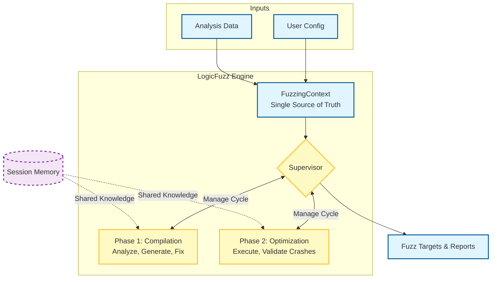

# LogicFuzz Workflow Diagrams

This document contains visual diagrams of the LogicFuzz workflow architecture.

---

## High-Level Architecture



---

## Phase 1: Compilation Phase (Detailed)

```
START
  │
  ▼
┌────────────────────────────────────────────────────────────────┐
│                    PHASE 1: COMPILATION                        │
│              Goal: Compile fuzz target successfully            │
└────────────────────────────────────────────────────────────────┘
  │
  ▼
┏━━━━━━━━━━━━━━━━━━━━┓
┃ Function Analyzer  ┃  ◀─── FuzzingContext
┃   (LLM Agent)      ┃       - Function signature
┗━━━━━━━━━━━━━━━━━━━━┛       - Call graph
  │                           - Type information
  │ Outputs:
  │ • API constraints: ["Must call init() before decode()"]
  │ • Archetype: "stateful_decoder"
  │ • Calling conventions
  │
  ▼
┏━━━━━━━━━━━━━━━━━━━━┓
┃    Prototyper      ┃  ◀─── Session Memory
┃   (LLM Agent)      ┃       - API constraints
┗━━━━━━━━━━━━━━━━━━━━┛       - Archetype
  │
  │ Generates:
  │ • fuzz_driver.cc
  │ • build.sh
  │
  ▼
┏━━━━━━━━━━━━━━━━━━━━┓
┃    Build Node      ┃  ◀─── OSS-Fuzz Docker
┃  (Non-LLM Exec)    ┃       environment
┗━━━━━━━━━━━━━━━━━━━━┛
  │
  │ Performs:
  │ • Compile with AddressSanitizer
  │ • Parse compilation errors
  │ • Validate target function call
  │
  ▼
┌─────────────────────┐
│ Compile Success?    │
└─────────────────────┘
  │         │
  │ NO      │ YES
  │         └──────────────────────────┐
  │                                    ▼
  ▼                            ┌──────────────────────┐
┏━━━━━━━━━━━━━━━━━━━━┓         │ Target Function      │
┃     Enhancer       ┃         │ Called in Driver?    │
┃   (LLM Agent)      ┃         └──────────────────────┘
┗━━━━━━━━━━━━━━━━━━━━┛           │              │
  │                             │ NO           │ YES
  │ Receives:                   ▼              ▼
  │ • Error context (±10 lines)┏━━━━━━━━━━━━━━━━━━━━┓
  │ • Session memory (known fixes)┃    Enhancer       ┃
  │                             ┃  (Validation Fix) ┃
  │ Generates:                  ┗━━━━━━━━━━━━━━━━━━━━┛
  │ • Fixed fuzz_driver.cc        │
  │ • Updated build.sh            │ Max 2 retries
  │                               ▼
  ▼                           ┌──────────────┐
┌──────────────────────┐      │ Still NO?    │
│ Retry Count < 3?     │      └──────────────┘
└──────────────────────┘        │        │
  │           │                 │ YES    │ NO
  │ YES       │ NO              │        │
  │           │                 ▼        │
  └───────────┤              ┌──────┐    │
    Loop back │              │ END  │    │
    to Build  ▼              │(fail)│    │
          ┌──────┐           └──────┘    │
          │ END  │                       │
          │(fail)│                       │
          └──────┘                       │
                                         │
                              ┌──────────┘
                              │
                              ▼
                   ┌────────────────────────┐
                   │  Switch to Phase 2     │
                   │  (OPTIMIZATION)        │
                   └────────────────────────┘
```

**Key Points:**
- **Max 3 compilation retries** → Fast failure
- **Max 2 validation retries** → Ensure target function is called
- **Error context extraction** → Only ±10 lines sent to LLM (95% token savings)
- **Session memory** → Known fixes reused across retries

---

## Phase 2: Optimization Phase (Detailed)

```
┌────────────────────────────────────────────────────────────────┐
│                  PHASE 2: OPTIMIZATION                         │
│         Goal: Execute fuzzer and validate crashes              │
└────────────────────────────────────────────────────────────────┘
  │
  ▼
┏━━━━━━━━━━━━━━━━━━━━┓
┃  Execution Node    ┃  ◀─── Compiled fuzz target
┃  (Non-LLM Exec)    ┃       - Run timeout: 60-300s
┗━━━━━━━━━━━━━━━━━━━━┛       - LLVM coverage enabled
  │
  │ Collects:
  │ • LLVM source-based coverage (textcov)
  │ • ASAN/UBSAN crash reports
  │ • Crash reproducers
  │
  ▼
┌─────────────────────┐
│  Crash Detected?    │
└─────────────────────┘
  │           │
  │ NO        │ YES
  │           │
  ▼           ▼
┌──────────────────┐  ┏━━━━━━━━━━━━━━━━━━━━┓
│  Log Coverage    │  ┃  Crash Analyzer    ┃
│  - PC coverage   │  ┃   (LLM Agent)      ┃
│  - Line coverage │  ┗━━━━━━━━━━━━━━━━━━━━┛
│  - Total PCs     │    │
└──────────────────┘    │ Analyzes:
  │                     │ • Stack trace
  │                     │ • ASAN report
  ▼                     │ • Crash location
┌──────────┐            │
│   END    │            │ Classifies:
│    ✓     │            │ • heap-buffer-overflow
└──────────┘            │ • stack-buffer-overflow
                        │ • use-after-free
                        │ • timeout
                        │ • out-of-memory
                        │
                        ▼
              ┏━━━━━━━━━━━━━━━━━━━━━━━━┓
              ┃ Crash Feasibility      ┃
              ┃      Analyzer          ┃
              ┃    (LLM Agent)         ┃
              ┗━━━━━━━━━━━━━━━━━━━━━━━━┛
                │
                │ Validates:
                │ • Is crash in target code? (not harness)
                │ • Reachable in real-world usage?
                │ • Security-relevant?
                │ • Reproducible?
                │
                ▼
         ┌─────────────────┐
         │   Feasible?     │
         │ (True Bug?)     │
         └─────────────────┘
           │             │
           │ YES         │ NO
           │             │
           ▼             ▼
    ┌────────────┐  ┏━━━━━━━━━━━━━━━━━━━━┓
    │    END     │  ┃     Enhancer       ┃
    │    🎉      │  ┃  (False Positive   ┃
    │ (True Bug!)│  ┃      Fix)          ┃
    └────────────┘  ┗━━━━━━━━━━━━━━━━━━━━┛
                      │
                      │ Fixes:
                      │ • Timeout in harness
                      │ • Initialization issue
                      │ • Cleanup issue
                      │
                      │ (1 attempt only)
                      │
                      ▼
                   ┌──────┐
                   │ END  │
                   │  ✓   │
                   └──────┘
```

**Key Points:**
- **Single-pass execution** → No iteration loops
- **No coverage iteration** → Log coverage and move on
- **Two-stage crash validation** → Filter false positives
- **One fix attempt** for false positives → Fast termination

---

## Agent Interaction Flow

```
┌─────────────────────────────────────────────────────────────────┐
│                 Supervisor + Session Memory                     │
│  ┌───────────────────────────────────────────────────────────┐  │
│  │  Session Memory (Shared Knowledge Base)                   │  │
│  │  ┌──────────────────────────────────────────────────────┐ │  │
│  │  │ • API Constraints: ["init() before decode()"]        │ │  │
│  │  │ • Archetype: "stateful_decoder"                      │ │  │
│  │  │ • Known Fixes: ["undefined ref → Add -lz"]          │ │  │
│  │  │ • Build Context: Error location + ±10 lines         │ │  │
│  │  └──────────────────────────────────────────────────────┘ │  │
│  │                                                           │  │
│  │  Injection: Top-3 relevant items by confidence + recency │  │
│  └───────────────────────────────────────────────────────────┘  │
└─────────────────────────────────────────────────────────────────┘
                          │
                          ▼
    ┌─────────────────────────────────────────────────────────┐
    │             Agent Ecosystem                              │
    └─────────────────────────────────────────────────────────┘
    
    🔵 Control Layer
    ┌─────────────────────┐
    │    Supervisor       │  • Phase-aware routing
    │  (Router/Non-LLM)   │  • Retry limit enforcement
    └─────────────────────┘  • Loop prevention
             │
             ├──────────────────────────────────────────┐
             │                                          │
             ▼                                          ▼
    🟡 Generation Layer                      🔴 Analysis Layer
    ┌─────────────────────┐                 ┌─────────────────────┐
    │ Function Analyzer   │                 │  Crash Analyzer     │
    │    (LLM Agent)      │                 │   (LLM Agent)       │
    └─────────────────────┘                 └─────────────────────┘
             │                                          │
             ▼                                          ▼
    ┌─────────────────────┐                 ┌─────────────────────┐
    │    Prototyper       │                 │Crash Feasibility    │
    │    (LLM Agent)      │                 │    Analyzer         │
    └─────────────────────┘                 │   (LLM Agent)       │
             │                               └─────────────────────┘
             ▼
    ┌─────────────────────┐
    │     Enhancer        │
    │    (LLM Agent)      │
    │  • Compilation fix  │
    │  • Validation fix   │
    │  • False pos. fix   │
    └─────────────────────┘
             │
             ▼
    🟣 Execution Layer
    ┌─────────────────────┐                 ┌─────────────────────┐
    │    Build Node       │                 │  Execution Node     │
    │  (Non-LLM Exec)     │                 │  (Non-LLM Exec)     │
    │  • OSS-Fuzz build   │                 │  • Run fuzzer       │
    │  • Error parsing    │                 │  • Collect coverage │
    │  • Validation       │                 │  • Detect crashes   │
    └─────────────────────┘                 └─────────────────────┘
```

---

## State Flow Diagram

```
┌──────────────────────────────────────────────────────────┐
│             FuzzingWorkflowState (TypedDict)             │
└──────────────────────────────────────────────────────────┘

Initial State                     Updated by Nodes
┌─────────────────┐              ┌────────────────────────┐
│ • benchmark     │              │ Function Analyzer:     │
│ • trial         │──────────────▶│ • function_analysis   │
│ • work_dirs     │              │ • session_memory       │
│ • context       │              └────────────────────────┘
└─────────────────┘                        │
                                           ▼
                                 ┌────────────────────────┐
                                 │ Prototyper:            │
                                 │ • fuzz_target_source   │
                                 │ • build_script_source  │
                                 └────────────────────────┘
                                           │
                                           ▼
                                 ┌────────────────────────┐
                                 │ Build Node:            │
                                 │ • compile_success      │
                                 │ • build_errors         │
                                 │ • target_function_     │
                                 │   called               │
                                 └────────────────────────┘
                                           │
                                           ▼
                                 ┌────────────────────────┐
                                 │ Enhancer:              │
                                 │ • fuzz_target_source   │
                                 │   (fixed)              │
                                 │ • session_memory       │
                                 │   (new fixes)          │
                                 └────────────────────────┘
                                           │
                                           ▼
                                 ┌────────────────────────┐
                                 │ Execution Node:        │
                                 │ • run_success          │
                                 │ • crashes              │
                                 │ • coverage_percent     │
                                 │ • crash_info           │
                                 └────────────────────────┘
                                           │
                                           ▼
                                 ┌────────────────────────┐
                                 │ Crash Analyzer:        │
                                 │ • crash_analysis       │
                                 └────────────────────────┘
                                           │
                                           ▼
                                 ┌────────────────────────┐
                                 │ Crash Feasibility:     │
                                 │ • context_analysis     │
                                 │   - feasible: bool     │
                                 │   - reasoning          │
                                 └────────────────────────┘

Final State
┌─────────────────────────────────────────────────────────┐
│ • All agent outputs                                     │
│ • Coverage metrics                                      │
│ • Crash analysis (if applicable)                        │
│ • Session memory (accumulated knowledge)                │
│ • workflow_phase: "optimization"                        │
│ • node_visit_counts: {...}                              │
└─────────────────────────────────────────────────────────┘
```

---

## Decision Tree: Supervisor Routing Logic

```
                         ┌──────────────────┐
                         │   START          │
                         └──────────────────┘
                                 │
                                 ▼
                    ┌────────────────────────┐
                    │ function_analysis      │
                    │ exists?                │
                    └────────────────────────┘
                      │                   │
                      │ NO                │ YES
                      ▼                   ▼
              ┌─────────────────┐  ┌─────────────────┐
              │function_analyzer│  │fuzz_target_     │
              │                 │  │source exists?   │
              └─────────────────┘  └─────────────────┘
                                     │           │
                                     │ NO        │ YES
                                     ▼           ▼
                             ┌─────────────┐  ┌─────────────────┐
                             │ prototyper  │  │ workflow_phase? │
                             └─────────────┘  └─────────────────┘
                                                │            │
                                   ┌────────────┤            │
                                   │compilation │optimization│
                                   ▼            ▼            ▼
                         ┌─────────────────┐         ┌─────────────────┐
                         │ compile_success?│         │  run_success?   │
                         └─────────────────┘         └─────────────────┘
                           │          │                │          │
                           │ None     │ True/False     │ None     │ True/False
                           ▼          ▼                ▼          ▼
                      ┌────────┐  ┌─────────┐    ┌────────┐  ┌─────────┐
                      │ build  │  │ False?  │    │execute │  │crashes? │
                      └────────┘  └─────────┘    └────────┘  └─────────┘
                                   │      │                    │      │
                                   │ YES  │ NO                 │ YES  │ NO
                                   ▼      │                    ▼      ▼
                        ┌────────────────┐│         ┌─────────────┐ ┌────┐
                        │retry_count < 3?││         │crash_analyzer│ │END │
                        └────────────────┘│         └─────────────┘ └────┘
                          │          │    │                │
                          │ YES      │ NO │                ▼
                          ▼          ▼    │     ┌────────────────────┐
                     ┌────────┐  ┌────┐  │     │crash_feasibility_  │
                     │enhancer│  │END │  │     │analyzer            │
                     └────────┘  └────┘  │     └────────────────────┘
                                         │                │
                                         │                ▼
                                         │      ┌──────────────────┐
                                         │      │ feasible?        │
                                         │      └──────────────────┘
                                         │        │            │
                                         │        │ YES        │ NO
                                         │        ▼            ▼
                                         │     ┌────┐    ┌────────┐
                                         │     │END │    │enhancer│
                                         │     │🎉  │    │(1 fix) │
                                         │     └────┘    └────────┘
                                         │                   │
                                         │                   ▼
                                         │                ┌────┐
                                         │                │END │
                                         │                └────┘
                                         │
                                         │ (validation check)
                                         │
                                         ▼
                                ┌─────────────────┐
                                │target_function_ │
                                │called?          │
                                └─────────────────┘
                                  │            │
                                  │ YES        │ NO
                                  ▼            ▼
                           ┌──────────┐  ┌────────────────┐
                           │execution │  │validation_fail_│
                           │(Phase 2) │  │count < 2?      │
                           └──────────┘  └────────────────┘
                                           │          │
                                           │ YES      │ NO
                                           ▼          ▼
                                      ┌────────┐  ┌────┐
                                      │enhancer│  │END │
                                      └────────┘  └────┘
```

---

## Token Flow Analysis

```
┌────────────────────────────────────────────────────────────┐
│                   Token Usage Per Phase                    │
└────────────────────────────────────────────────────────────┘

Phase 1: COMPILATION
┌──────────────────────┬──────────┬────────────────────────┐
│ Node                 │ Tokens   │ Description            │
├──────────────────────┼──────────┼────────────────────────┤
│ Function Analyzer    │ 5-10k    │ Initial analysis       │
│ Prototyper           │ 8-15k    │ Code generation        │
│ Enhancer (per retry) │ 3-5k     │ Error fixing           │
│   × 2-3 retries      │ 6-15k    │ Typical: 2 retries     │
│ Session Memory       │ 0.5-1k   │ Injected into prompts  │
├──────────────────────┼──────────┼────────────────────────┤
│ TOTAL (Phase 1)      │ 20-40k   │ Success case           │
└──────────────────────┴──────────┴────────────────────────┘

Phase 2: OPTIMIZATION
┌──────────────────────┬──────────┬────────────────────────┐
│ Node                 │ Tokens   │ Description            │
├──────────────────────┼──────────┼────────────────────────┤
│ Crash Analyzer       │ 2-4k     │ If crash detected      │
│ Crash Feasibility    │ 3-6k     │ Deep validation        │
│ Enhancer (false pos) │ 3-5k     │ 1 fix attempt          │
├──────────────────────┼──────────┼────────────────────────┤
│ TOTAL (Phase 2)      │ 0-15k    │ 0 if no crash          │
│                      │          │ 5-10k if feasible crash│
│                      │          │ 8-15k if false positive│
└──────────────────────┴──────────┴────────────────────────┘

GRAND TOTAL: 20-55k tokens per trial

Comparison with Previous Version (with conversation history):
┌──────────────────────┬──────────┬──────────┬────────────┐
│ Component            │ Old      │ New      │ Savings    │
├──────────────────────┼──────────┼──────────┼────────────┤
│ Conversation History │ 100k+    │ 0        │ 100%       │
│ Session Memory       │ 0        │ 0.5-1k   │ N/A        │
│ Error Context        │ Full file│ ±10 lines│ 95%        │
│ Coverage Iteration   │ 30-50k   │ 0        │ 100%       │
├──────────────────────┼──────────┼──────────┼────────────┤
│ TOTAL SAVINGS        │          │          │ ~70-80%    │
└──────────────────────┴──────────┴──────────┴────────────┘
```

---

## Error Handling Strategies

```
┌────────────────────────────────────────────────────────────┐
│              Error Types and Recovery Strategies           │
└────────────────────────────────────────────────────────────┘

Compilation Errors
├─ Syntax errors           → Enhancer (±10 lines context)
├─ Undefined references    → Enhancer + session memory (known fixes)
├─ Type mismatches         → Enhancer (error context)
├─ Missing headers         → Enhancer (check FuzzingContext.header_info)
└─ Linker errors           → Enhancer (update build.sh)
   │
   └─ Max 3 retries → END (fail fast)

Validation Errors
├─ Target function not called  → Enhancer (fix driver logic)
└─ Incorrect function signature → Enhancer (fix function call)
   │
   └─ Max 2 retries → END (fail fast)

Runtime Errors (Optimization Phase)
├─ Crashes (in target code)
│  ├─ heap-buffer-overflow   → Crash Analyzer → Feasibility → END (🎉 bug!)
│  ├─ use-after-free         → Crash Analyzer → Feasibility → END (🎉 bug!)
│  └─ stack-buffer-overflow  → Crash Analyzer → Feasibility → END (🎉 bug!)
│
├─ Crashes (in harness)
│  ├─ Timeout                → Feasibility (not feasible) → Enhancer (1 fix)
│  ├─ Initialization error   → Feasibility (not feasible) → Enhancer (1 fix)
│  └─ Cleanup error          → Feasibility (not feasible) → Enhancer (1 fix)
│
└─ Execution failures
   ├─ Timeout (pure)         → END (no fix attempt)
   └─ Other infra errors     → Enhancer (1 fix) → END
```

---

## Key Design Decisions

### 1. Why No Coverage Iteration?

**Old approach:**
```
Execute → Coverage Analyzer → Enhancer → Build → Execute → ...
(Repeat until coverage stable)

Cost: ~50k tokens + 5 min per iteration
Benefit: ~5-10% coverage increase
ROI: Low (high cost, marginal bug finding)
```

**New approach:**
```
Execute once → Log coverage → END

Cost: 0 tokens (no iteration)
Benefit: Same bug finding rate
ROI: High (fast termination, low cost)
```

### 2. Why Session Memory Over Conversation History?

**Conversation history:**
- Full message logs per agent: 100k+ tokens
- Redundant information (repeated prompts, full code)
- Slow to process

**Session memory:**
- Key insights only: 3-5 items (~1k tokens)
- Structured data (constraints, fixes, archetypes)
- Fast to inject

**Result:** 90% memory reduction, faster execution

### 3. Why Strict Retry Limits?

**Empirical observation:**
- If 3 compilation retries don't fix it → likely unfixable (missing library, unsupported API)
- If 2 validation retries don't fix it → likely architectural issue (wrong approach)
- If 1 false positive fix doesn't work → likely complex harness issue (not worth iteration)

**Result:** Faster failure, clearer error messages, lower token cost

---

## Next Steps

For more details on specific components:

- **Implementation**: See [agent_graph/README.md](../agent_graph/README.md)
- **Prompts**: See [prompts/](../prompts/)
- **Setup Guide**: See [docs/NEW_PROJECT_SETUP.md](NEW_PROJECT_SETUP.md)
- **Quick Start**: See [Usage.md](../Usage.md)

